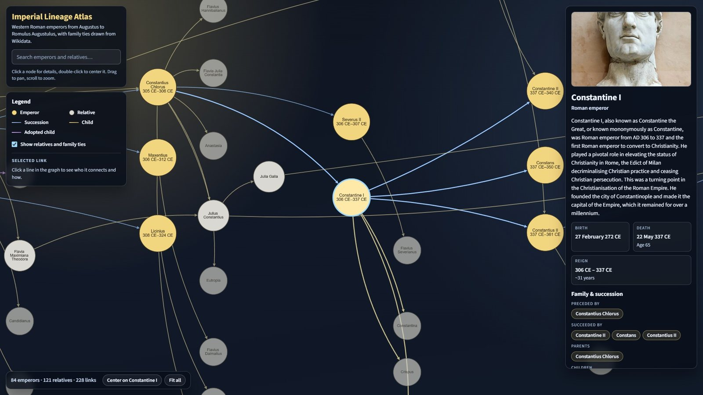

# Imperial Lineage Atlas

An interactive map of the Western Roman emperors, from Augustus (27 BCE) to Romulus Augustulus (476 CE). The succession chain is drawn as a graph you can pan and zoom, with each emperor's descendants alongside it: children, adopted heirs and the relatives who linked one dynasty to the next.

**Live:** [imperial-lineage.vercel.app](https://imperial-lineage.vercel.app/)



Built with React, TypeScript, Vite and Cytoscape.js. All historical data comes from Wikipedia and Wikidata and is precomputed into a JSON file, so the app makes no API calls at runtime; only the portrait images load from Wikimedia Commons.

## Features

- **Succession graph** of 84 emperors laid out left to right as a timeline, with co-emperors stacked at the same step.
- **Family trees** up to four generations deep for every emperor, with adopted heirs drawn in a distinct colour and disputed or uncertain parentage drawn dashed. A toggle hides relatives to show the bare succession chain.
- **Detail panel** with portrait, biography, birth and death dates, age at death, reign length and a link to the source article.
- **Navigation aids**: search by name, clickable chips for predecessors, successors, parents and children, and buttons to re-centre or fit the graph.
- **Link inspector**: click any line to see who it connects and whether it is a succession, child or adopted-child relationship, and whether the source treats it as uncertain.
- **Portrait lightbox** that fetches a higher-resolution rendition of the Wikimedia image.

## Running locally

```bash
npm install
npm run dev
```

Then open the URL Vite prints (normally `http://localhost:5173`).

Other scripts:

| Command | What it does |
| --- | --- |
| `npm run build` | Type-checks and builds a production bundle into `dist/` |
| `npm run preview` | Serves the production bundle locally |
| `npm run lint` | Runs ESLint |
| `npm run audit:data` | Checks the generated lineage for impossible dates and family links |
| `npm run audit:wikipedia` | Compares the years shown with each person's Wikipedia infobox (needs network) |

## How the data is produced

The list of emperors, their reign dates and the succession order live in `src/data/seedWesternEmperors.ts`. Everything else is generated by `scripts/generate-descendants.mts`, which:

1. Resolves each emperor's Wikipedia title to a Wikidata item.
2. Walks Wikidata's *child* (P40) claims up to four generations deep, noting adoptions via the *kinship to subject* qualifier, flagging links Wikidata qualifies as disputed, possible or presumed, and skipping any claim listed in `src/data/lineageCorrections.ts`.
3. Fetches a short biography and a portrait thumbnail for every person with an English Wikipedia article, and birth/death dates for everyone, replacing any date listed in `src/data/lineageCorrections.ts`.
4. Writes the result to `src/data/generatedDescendants.json`.

People who exist in Wikidata but have no English Wikipedia article are kept as lineage nodes (linked to their Wikidata page) with dates only. They receive no biography or portrait, because bare-name lookups on Wikipedia return unrelated pages. The same goes for people whose article title redirects to someone else's article, usually a spouse or parent.

Dates keep the precision Wikidata records and no more. Where a claim is only known to the decade or century it is stored as `240s CE` or `3rd century CE` rather than as an invented day, and dates Wikidata marks as approximate are prefixed `c.`. When an item carries several dates, the preferred-rank claim wins, then the most precise.

To regenerate the data:

```bash
# All emperors (takes a while; respects Wikimedia rate limits)
npm run build:data

# Only the first N emperors, useful for checking changes
npm run build:data -- --count 5

# Resume from a given emperor id after an interruption
npm run build:data:resume -- augustus
```

Then run `npm run audit:data` to check the result, and `npm run build` to bundle the new data.

## Checking the lineage

`npm run audit:data` reads the generated file (no network needed) and reports records that cannot be true: a death before a birth, a child born before its parent was twelve or more than a year after the parent died, a child who died before the parent was born, more than two birth parents, an ancestry loop, or one person stored under two ids. Unusual but possible records, such as a parent over 70 or a life over 100 years, are listed as warnings. Each date is treated as the full range it could cover (`3rd century CE` is 201 to 300, `c.` adds five years either way), so an error means the record is impossible under any reading. CI runs the audit on every push.

An error has one of two causes:

- **The date is wrong or vaguer than it looks.** Check the person's Wikidata item and fix the date there if you can; until then, add the correct date to `dateOverrides` in `src/data/lineageCorrections.ts` with the reason and a source, and regenerate.
- **The family link is wrong.** Wikidata sometimes attaches a child to the wrong person of the same name. Fix the claim on Wikidata if you can; until then, add it to `excludedChildClaims` in the same file, and regenerate.

Every departure from Wikidata is recorded in that file with its reason and source, so it can be defended, and an entry should be removed once Wikidata has been fixed.

### Comparing with Wikipedia

The dates come from Wikidata, which is a separate database from the Wikipedia articles and is not kept in step with them. `npm run audit:wikipedia` fetches each person's article and compares the birth, death and reign years in its infobox with the ones shown here. Infobox dates are free text, so the comparison is a heuristic and its output is a list of things to look at, not of errors: `c. 164` against `c. 165` is not a mistake on either side. Where the two genuinely disagree, check which sources the article cites; if Wikidata is the one that is wrong, add a `dateOverrides` entry. It is not part of CI because it needs the network and changes whenever an article is edited.

## Project layout

```
src/
  App.tsx                    App shell: state, search, legend, footer
  components/
    EmperorGraph.tsx         Cytoscape wrapper, styling and viewport control
    EmperorDetail.tsx        Side panel with facts, relatives and the lightbox
  lib/
    graphElements.ts         Deterministic layout of emperors and relatives
    format.ts                Date parsing/formatting and URL helpers
  data/
    seedWesternEmperors.ts   Hand-curated emperor list and succession order
    lineageCorrections.ts    Wikidata links and dates known to be wrong, with reasons and sources
    generatedDescendants.json  Precomputed family data and metadata
scripts/
  generate-descendants.mts   Wikidata/Wikipedia data generator
  audit-lineage.mts          Plausibility checks on the generated data
  compare-wikipedia.mts      Year-by-year comparison with Wikipedia infoboxes
```

## Notes on accuracy

- Reign dates are year-level, so reign lengths are approximate and shown with a `~`.
- Age at death is exact only when both dates are known to the day; otherwise it is marked `~`. No age is shown when either date is only known to the decade or century.
- Succession follows the commonly listed Western line. Usurpers and Eastern emperors are out of scope.
- Family links and dates reflect Wikidata as of the generation date recorded in the JSON file, apart from the corrections listed in `src/data/lineageCorrections.ts`.
- Some parentage rests on ancient rumour or propaganda, such as Elagabalus being presented as Caracalla's son. Where Wikidata qualifies a link as disputed, possible or presumed, the link is kept but labelled uncertain rather than shown as fact.
- The audit catches records that are impossible, not ones that are merely wrong. A plausible but mistaken date or parent passes it, so the data is only as good as Wikidata's sourcing.

## License

The source code is released under the [MIT License](LICENSE).

Biographies in `src/data/generatedDescendants.json` are excerpts from Wikipedia, available under [CC BY-SA 4.0](https://creativecommons.org/licenses/by-sa/4.0/); each entry links back to its source article. Structured data from Wikidata is [CC0](https://creativecommons.org/publicdomain/zero/1.0/). Portraits are loaded from Wikimedia Commons and remain under their individual licenses.
